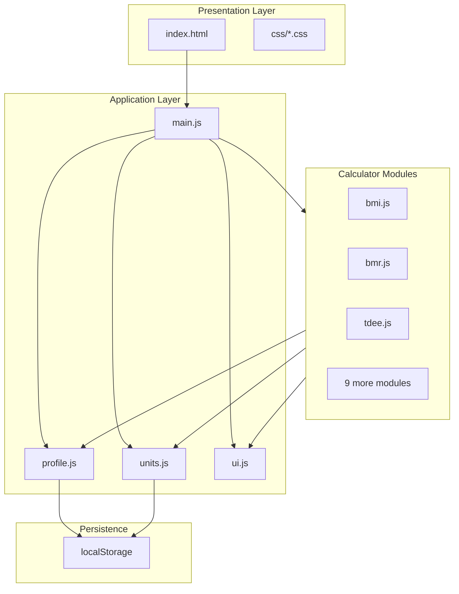

# DataFit - Development Plan

Living architecture document for the DataFit fitness calculator suite.

**Live site:** https://datafit-iota.vercel.app

## Goals

1. **Aesthetics first** - match the reference hero: dark grid, neon green, terminal typography
2. **Responsive** - full-viewport sections on all devices
3. **Functional** - accurate, well-sourced formulas with live compute
4. **Zero dependencies** - plain HTML/CSS/JS, no build step

## Architecture



## File Structure

```
DataFit/
├── index.html
├── css/
│   ├── variables.css      # Design tokens
│   ├── base.css           # Reset, grid bg, typography
│   ├── layout.css         # Sections, scroll-snap, nav, footer
│   ├── components.css     # Inputs, results, formula panels, modal
│   └── responsive.css     # Breakpoints, touch, reduced-motion
├── js/
│   ├── main.js            # Init, nav, unit toggle, recompute
│   ├── units.js           # Metric ↔ imperial
│   ├── profile.js         # Shared operator profile
│   ├── ui.js              # Input binding, validation, render
│   └── calculators/       # One file per module
├── docs/
│   ├── SITE.md
│   ├── PLAN.md            # This file
│   ├── USER_GUIDE.md
│   └── FORMULAS.md
└── README.md
```

## Design Tokens

Defined in `css/variables.css`:

| Variable        | Value                  | Usage        |
| --------------- | ---------------------- | ------------ |
| `--bg-deep`     | `#050805`              | Background   |
| `--accent-neon` | `#CCFF00`              | Accent       |
| `--text-muted`  | `#5a6b5a`              | Secondary    |
| `--border-dim`  | `rgba(204,255,0,0.25)` | Borders      |
| `--glow-text`   | multi-layer shadow     | Hero/results |

Fonts loaded via Google Fonts CDN in `index.html`.

## JavaScript Patterns

### Calculator Init Pattern

Each calculator exports `initXXX(section)`:

1. Bind inputs with `bindInput` / `bindSelect` / `bindSegment`
2. Save profile fields where applicable
3. Bind formula panel toggle
4. Run initial `compute(section)`

### Compute Pattern

Each calculator exports `computeXXX(section)`:

1. Read inputs (via `units.js` parsers for metric internal math)
2. Validate - return `-` if incomplete
3. Call `renderResult()` with value, unit, label, extras

### Cross-Module Data

- BMR stores `dataset.bmr` on its section element
- TDEE reads BMR from BMR module or manual override; stores `dataset.tdee` and `dataset.bmr`
- Body Fat stores `dataset.bodyFat` and saves to profile
- FFMI/BFMI/Lean Mass read body fat from input, stored dataset, or profile

`main.js` listens for `profilechange` and `unitchange` events to recompute all modules.

## Build Phases (Completed)

### Phase 1 - Foundation

- [x] CSS design system
- [x] Hero section matching reference
- [x] Scroll-snap layout
- [x] Dot navigation
- [x] Status bar footer

### Phase 2 - Core JS + First Calculators

- [x] `units.js`, `ui.js`, `profile.js`, `main.js`
- [x] BMI, BMR, TDEE

### Phase 3 - Remaining Calculators

- [x] IBW, Body Fat, FFMI, BFMI, Lean Mass, Protein, Max Potential
- [x] Shared profile localStorage
- [x] Formula panels

### Phase 4 - Responsive & Polish

- [x] Mobile dot nav → bottom bar
- [x] Touch targets
- [x] Reduced motion
- [x] High contrast preference

### Phase 5 - Documentation

- [x] README.md
- [x] docs/SITE.md, PLAN.md, USER_GUIDE.md, FORMULAS.md

## Future Enhancements (Backlog)

- [x] Unified activity level input inside central PROFILE section, automatically syncing TDEE and Protein target calculators

- [x] Persistent session memory (localStorage) for all central PROFILE inputs
- [ ] Replace `[safoun_]` placeholder with author name
- [ ] Favicon and Open Graph image in `assets/`
- [ ] Export results as JSON/CSV
- [ ] Dark/light is unnecessary - brand is dark-only
- [ ] PWA manifest for installable shortcut
- [ ] Additional body fat methods (Jackson-Pollock calipers)
- [ ] Wilks / DOTS powerlifting scores
- [ ] Target heart rate zones module

## Deployment

Live site:
- **https://datafit-iota.vercel.app** - Production deployment

Local deployment options:
- **GitHub Pages:** push repo, enable Pages on `main`
- **Netlify / Vercel:** drag folder or connect repo
- **Local:** open `index.html` directly (ES modules work on `file://` in most browsers; `serve` recommended)

## Testing Checklist

- [ ] Hero CTA scrolls to BMI
- [ ] Dot nav highlights active section on scroll
- [ ] Unit toggle converts labels and recomputes
- [ ] Profile syncs height/weight across modules
- [ ] Body fat from Module 06 flows to FFMI/BFMI/Lean Mass
- [ ] BMR auto-feeds TDEE
- [ ] Formula panels expand/collapse
- [ ] Modal opens/closes
- [ ] Mobile layout: bottom nav, stacked inputs
- [ ] Keyboard arrow navigation between sections

## Related Docs

- [SITE.md](SITE.md) - user-facing site description
- [FORMULAS.md](FORMULAS.md) - equation reference
- [USER_GUIDE.md](USER_GUIDE.md) - end-user instructions
- [TEST_CASES.md](TEST_CASES.md) - failure modes and robustness guide
